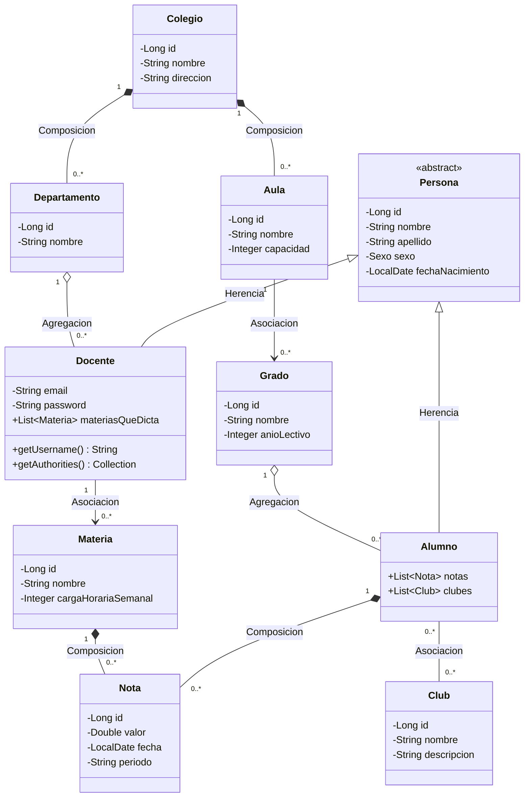

# Diagrama de Clases de Diseño (actualizado con login de docentes)

## Justificación de cada relación UML pedida

| Relación | Dónde aparece | Por qué es esa y no otra |
|---|---|---|
| **Herencia** | `Persona` → `Alumno`, `Docente` | Alumno y Docente comparten atributos (nombre, apellido, sexo, fecha de nacimiento) pero tienen comportamiento y datos propios (Docente además tiene login). |
| **Composición** | `Colegio` *-- `Aula`, `Colegio` *-- `Departamento`, `Alumno`/`Materia` *-- `Nota` | La parte no tiene sentido ni ciclo de vida propio sin el todo: un aula no existe sin su colegio, una nota no existe sin su alumno y su materia. |
| **Agregación** | `Departamento` o-- `Docente`, `Grado` o-- `Alumno` | El todo agrupa a la parte, pero la parte sobrevive y tiene sentido por sí sola aunque se elimine el todo o cambie de "contenedor" (un docente puede cambiar de departamento, un alumno de grado). |
| **Asociación** | `Aula` → `Grado`, `Docente` → `Materia`, `Alumno` -- `Club` | Ambas clases existen de forma completamente independiente; solo se referencian entre sí. |

**Nuevas funcionalidades agregadas al problema original** (requisito de la parte *a*): `Colegio`, `Departamento` y `Club` (actividades extracurriculares). Estas entidades no estaban en el enunciado original y se incorporan específicamente para poder mostrar las 4 relaciones UML pedidas de forma clara y con sentido de negocio real.

**Login de docentes** (requisito de la parte *i*): se agregó a `Docente` los atributos `email` (usado como *username*) y `password` (hash BCrypt), y la entidad implementa `UserDetails` de Spring Security. Esto no rompe el diagrama original: solo extiende la clase `Docente` ya existente.
